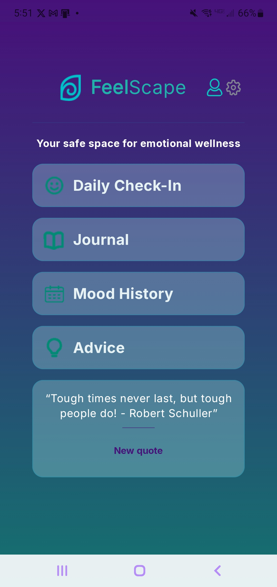
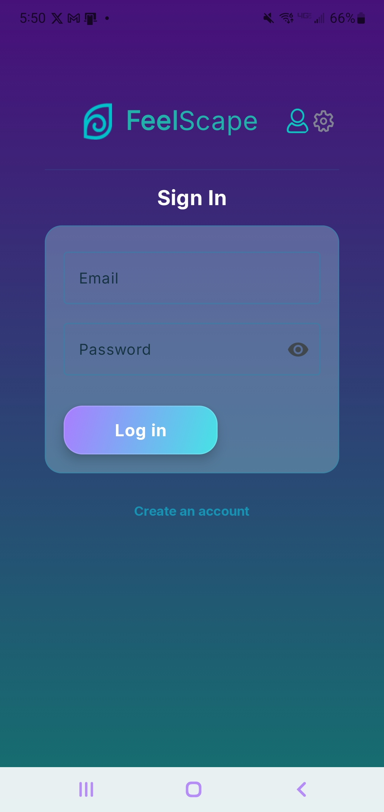
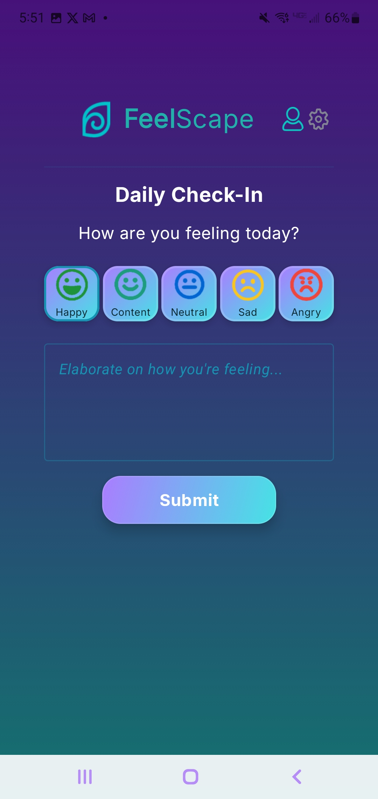
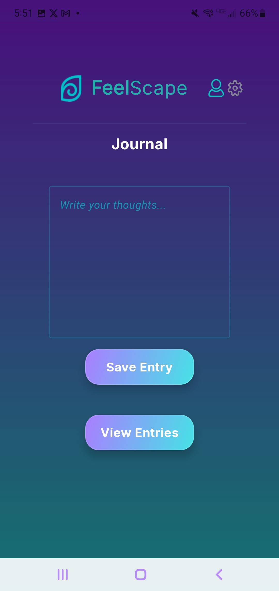
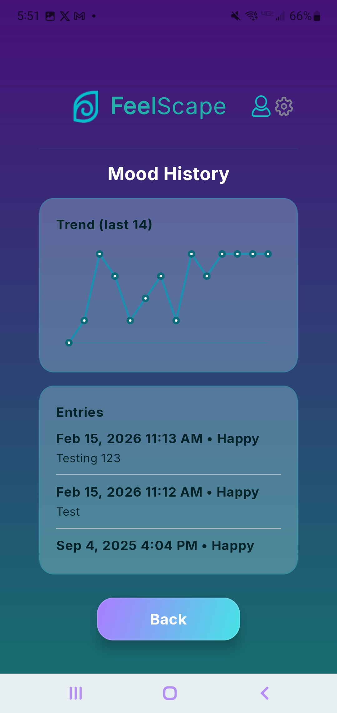
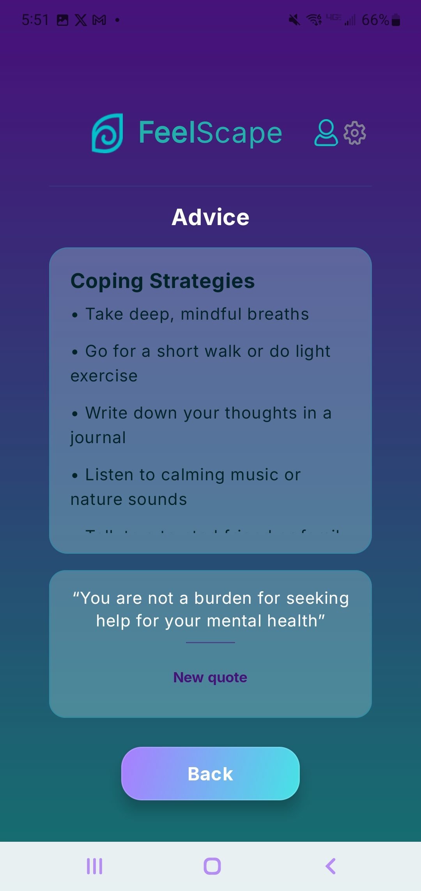
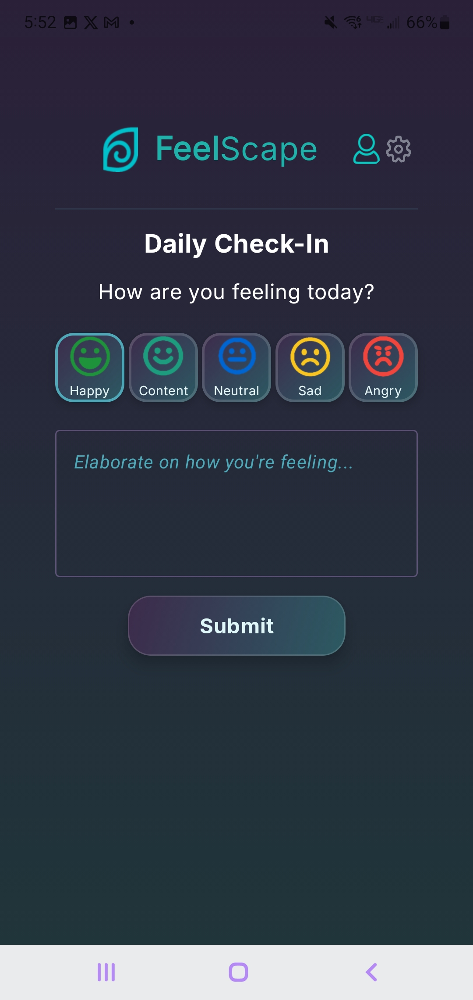
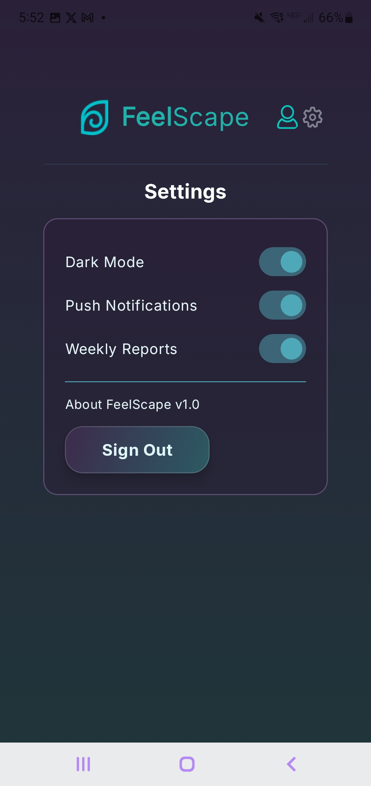

# 🌿 FeelScape

<p align="center">
  <em>A modern Android application that encourages emotional wellness through daily reflection, mood tracking, journaling, and positive coping strategies.</em>
</p>

<p align="center">


</p>

---

# 📖 Overview

FeelScape is a native Android application designed to encourage healthier emotional habits through daily reflection, mood tracking, journaling, and wellness resources.

Built using **Kotlin**, **Jetpack Compose**, **Material Design 3**, and **Firebase**, the application provides users with a clean, modern interface for tracking their emotional well-being while promoting mindfulness and self-care.

Originally developed as a collaborative software engineering project at **Full Sail University**, this repository is maintained as my personal portfolio version highlighting my contributions and continued improvements.

---

# 🚧 Project Status

Current progress:

- ✅ Core application UI completed
- ✅ Firebase Authentication integrated
- ✅ Daily emotional check-in workflow
- ✅ Journal functionality
- ✅ Mood history visualization
- ✅ Wellness advice section
- ✅ Light & Dark Mode support
- 🚀 Ongoing portfolio improvements

---

## 🎯 What I Learned

This project strengthened my experience with:

- Building native Android applications using Kotlin
- Creating modern UIs with Jetpack Compose
- Integrating Firebase Authentication
- Managing application state and navigation
- Implementing Light and Dark Mode themes
- Applying Material Design 3 principles
- Working collaboratively using Git and GitHub

---

# ✨ Features

- 🔐 Secure Firebase Authentication
- 😊 Daily emotional check-ins
- 📔 Personal journal entries
- 📈 Mood history tracking
- 💡 Wellness advice and coping strategies
- 🌙 Light & Dark Mode
- 🔔 Notification preferences
- 🎨 Material Design 3 interface

---

# 📱 User Interface

| Home | Sign In |
|:---:|:---:|
|  |  |

| Daily Check-In | Journal |
|:---:|:---:|
|  |  |

| Mood History | Advice |
|:---:|:---:|
|  |  |

| Dark Mode Check-In | Dark Mode Settings |
|:---:|:---:|
|  |  |

---

# 🛠 Tech Stack

| Technology | Purpose |
|------------|---------|
| Kotlin | Primary programming language |
| Jetpack Compose | Declarative Android UI |
| Material Design 3 | Modern Android interface |
| Firebase Authentication | User authentication |
| Firebase Firestore | Cloud database |
| Android Studio | Development environment |
| Gradle | Build automation |

---

# 🚀 Running the Project

Clone the repository:

```bash
git clone https://github.com/Nica-17/FeelScape.git
```

Open the project in **Android Studio**.

Add your own Firebase configuration (`google-services.json`).

Allow Gradle to sync the project.

Run on an Android emulator or physical Android device.

---

# 👩‍💻 My Contributions

This repository showcases my individual contributions to the FeelScape project, including:

- UI/UX design and visual polish
- Jetpack Compose implementation
- Navigation flow
- Firebase Authentication integration
- Daily check-in experience
- Journal interface
- Mood history screens
- Dark Mode support
- Material Design 3 styling
- Ongoing maintenance and portfolio enhancements

---

# 🔮 Future Improvements

Potential future enhancements include:

- Personalized wellness recommendations
- Push notification reminders
- Expanded mood analytics
- Calendar view for journal entries
- Data export and backup
- Accessibility improvements
- User profile customization
